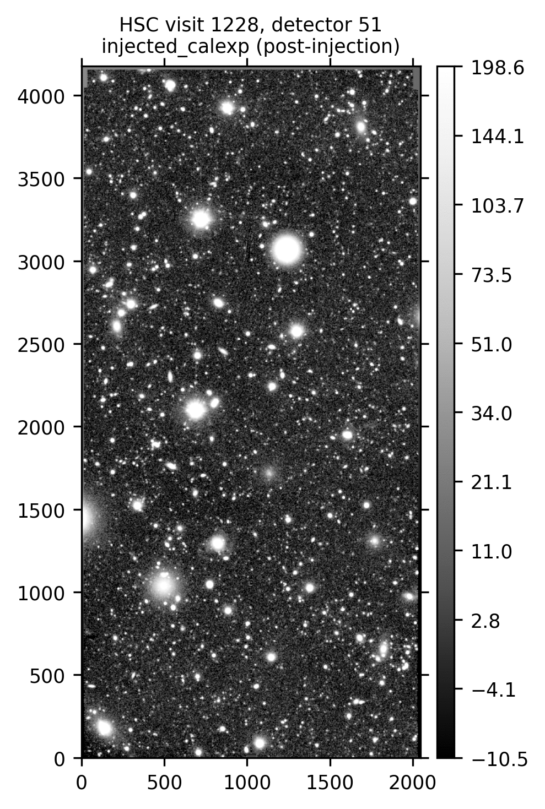
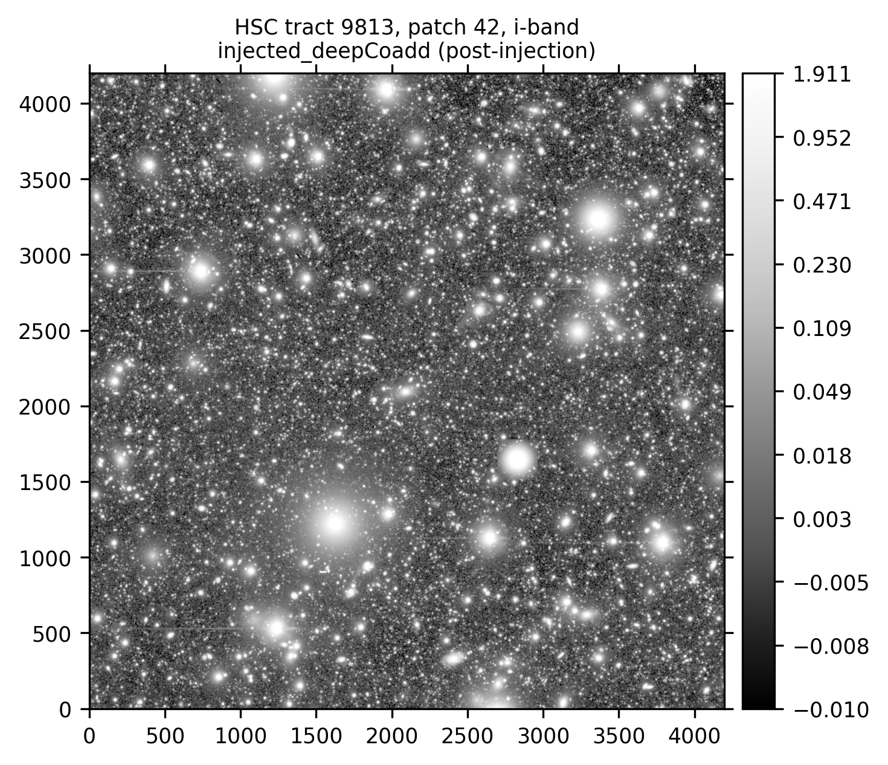
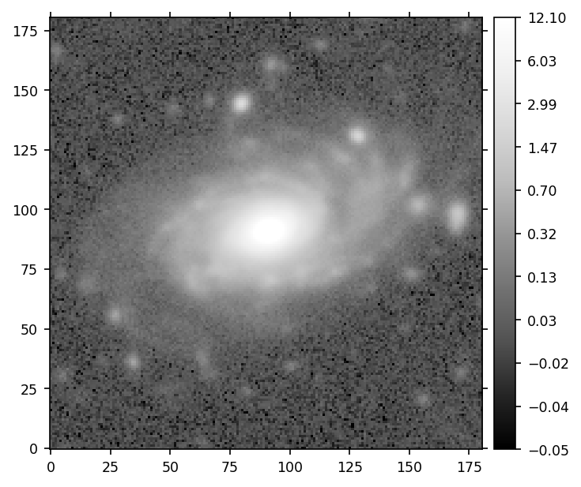
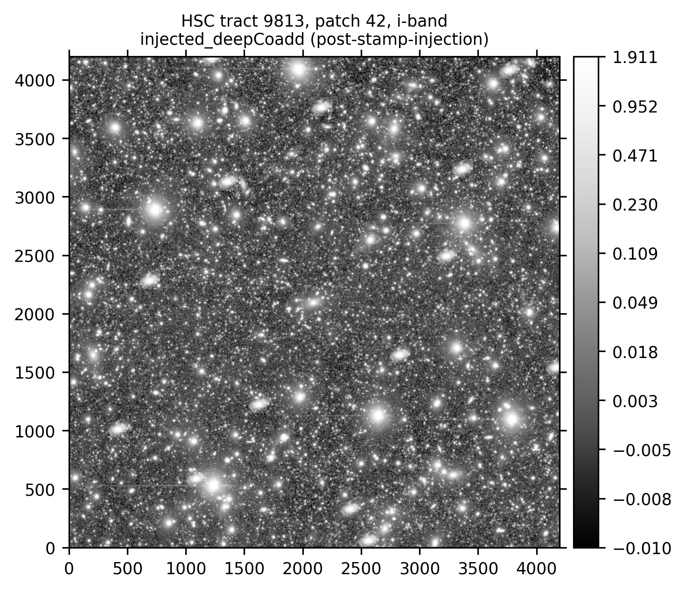

.. _lsst.source.injection-ref-inject:

==========================
 Inject Synthetic Sources
==========================

---------------------------------------------------------------------------
 Injecting Synthetic Sources Into Visit-Level or Coadd-Level Dataset Types
---------------------------------------------------------------------------

Synthetic sources can be injected into any imaging data product output by the LSST Science Pipelines.
This is useful for testing algorithmic performance on simulated data, where the truth is known, and for various subsequent quality assurance tasks.

The sections below describe how to inject synthetic sources into a visit-level exposure-type or visit-type datasets (i.e., datasets with the dimension ``exposure`` or ``visit``), or into a coadd-level dataset.
Options for injection on the command line and in Python are presented.

Prior to injection, the instructions on this page assume that the user will already have in-place a fully qualified source injection pipeline definition YAML (see :ref:`lsst.source.injection-ref-make`) and a suitable synthetic source injection catalog describing the sources to be injected (see :ref:`lsst.source.injection-ref-generate`) which has been ingested into the data butler (see :ref:`lsst.source.injection-ref-ingest`).

.. _lsst.source.injection-ref-inject-cli:

Injection on the Command Line
=============================

Source injection on the command line is performed using the :command:`pipetask run` command.
The process for injection into visit-level imaging (i.e., ``exposure`` or ``visit`` type data) or injection into coadd-level imaging (e.g., a `deep_coadd_predetection``) is largely the same, save for the use of a different data query and a different injection task or pipeline subset.

The following command line example injects synthetic sources into the HSC exposure 1228, detector 51, ``post_isr_image`` dataset.
For the purposes of this example, we will run the entirety of the HSC DRP RC2 step 1 subset.
This subset contains all the tasks necessary to process raw science data through to initial visit-level calibrated outputs.
The step 1 subset will have had the ``inject_exposure`` task (:lsst-task:`~lsst.source.injection.ExposureInjectTask`) merged into it following a successful run of :doc:`make_injection_pipeline <../scripts/make_injection_pipeline>`.

.. tip::

    Injection into a coadd-level data product such as a ``deep_coadd_predetection`` can easily be achieved by substituting ``step1`` for ``step3`` in the command below and modifying the ``-d`` data query.
    For the injection catalog generated in these notes, this coadd-level data query would work well:

    .. code-block::

        -d "instrument='HSC' AND skymap='hsc_rings_v1' AND tract=9813 AND patch=42 AND band='i'"

.. code::

    pipetask --long-log --log-file $LOGFILE \
    run --register-dataset-types \
    -b $REPO \
    -i $INPUT_DATA_COLL,$INJECTION_CATALOG_COLL \
    -o $OUTPUT_COLL \
    -p DRP-RC2+injection.yaml#step1 \
    -d "instrument='HSC' AND exposure=1228 AND detector=51"

*where*

    `$LOGFILE`
        The full path to a user-defined output log file.

    `$REPO`
        The path to the butler repository.

    `$INPUT_DATA_COLL`
        The name of the input data collection.

    `$INJECTION_CATALOG_COLL`
        The name of the input injection catalog collection.

    `$OUTPUT_COLL`
        The name of the injected output collection.

.. caution::

    Standard processing should not normally have to make use of the ``--register-dataset-types`` flag.
    This flag is only required to register a new output dataset type with the butler for the very first time.

    If injection outputs have already been generated within your butler repository, you should omit this flag from your run command to prevent any accidental registration of unwanted dataset types.

.. note::

    Similar to ``stepN`` subsets are ``injected_stepN`` subsets.
    These only run tasks including and after the injection task.
    The ``injected_stepN`` subsets can save memory and runtime if the tasks prior to injection have already been run.

The image plane of the ``injected_post_isr_image`` will be modified from the original by the addition of a light profile for every injected object.
By default the injected light profiles have simulated shot noise added. This can be turned off by setting ``add_noise`` to ``False`` in the injection task config.
The variance plane gains additional estimated variance consistent with the amount of light added to the image plane, including any simulated noise.

.. caution::

    Setting ``inject_variance`` to ``False`` in the injection task config will prevent any changes to the variance plane.
    This is likely to bias any downstream measurements and should normally never be done, unless such bias is the object of study.

Assuming processing completes successfully, the ``injected_post_isr_image`` and associated ``injected_post_isr_image_catalog`` will be written to the butler repository.
Various downstream ``step1`` data products should also exist, including the ``injected_preliminary_visit_image`` dataset type (see example images below).

Standard log messages that get printed as part of a successful run may include lines similar to:

.. code-block:: shell

    Retrieved 25 injection sources from 1 HTM trixel.
    Identified 19 injection sources with centroids outside the padded image bounding box.
    Catalog cleaning removed 19 of 25 sources; 6 remaining for catalog checking.
    Catalog checking flagged 0 of 6 sources; 6 remaining for source generation.
    Adding INJECTED and INJECTED_CORE mask planes to the exposure.
    Generating 6 injection sources consisting of 1 unique type: Sersic(6).
    Injected 6 of 6 potential sources. 0 sources flagged and skipped.

An example injected output produced by the above snippet is shown below.

    ..

    Calibrated exposure (``preliminary_visit_image`` and
    ``injected_preliminary_visit_image``) data for HSC visit 1228, detector
    51, showcasing the injection of a series of synthetic Sérsic sources.
    Images are asinh scaled across the central 98% flux range and smoothed with a Gaussian kernel of FWHM 5 pixels.

    .. list-table::
        :widths: 1 1 1

        * - .. figure:: ../_assets/v1228d51_pre_injection.png
                :name: v1228d51_pre_injection
                :alt: HSC visit 1228, detector 51, before source injection.
                :align: center
                :width: 100%

                ..

                Before injection.
          - .. figure:: ../_assets/v1228d51_post_injection.png
                :name: v1228d51_post_injection
                :alt: HSC visit 1228, detector 51, after source injection.
                :align: center
                :width: 100%

                ..

                After injection.
          - .. figure:: ../_assets/v1228d51_difference.png
                :name: v1228d51_difference
                :alt: HSC visit 1228, detector 51, difference.
                :align: center
                :width: 100%

                ..

                Difference image.

.. _lsst.source.injection-ref-inject-python:

Injection in Python
===================

Source injection in Python is achieved by using the source injection task classes directly.
As on the command line, the process for injection into visit-level imaging or coadd-level imaging is largely the same, save for the use of a different task class, a different data query, and use of different calibration data products (see the notes in the Python snippet below).

The following Python example injects synthetic sources into the HSC i-band tract 9813, patch 42, ``deep_coadd_predetection`` dataset.
For the purposes of this example, we will just run the source injection task alone.

.. code-block:: python

    from lsst.daf.butler import Butler
    from lsst.source.injection import CoaddInjectConfig,CoaddInjectTask
    # NOTE: For injections into other dataset types, use the following instead:
    # from lsst.source.injection import ExposureInjectConfig,ExposureInjectTask
    # from lsst.source.injection import VisitInjectConfig,VisitInjectTask

    # Instantiate a butler.
    butler = Butler(REPO)

    # Load an input coadd dataset.
    dataId = dict(
        instrument="HSC",
        skymap="hsc_rings_v1",
        tract=9813,
        patch=42,
        band="i",
    )
    input_exposure = butler.get(
        "deepCoadd",
        dataId=dataId,
        collections=INPUT_DATA_COLL,
    )
    # NOTE: Visit-level injections also require a visit summary table.
    # visit_summary = butler.get(
    #     "visit_summary",
    #     dataId=dataId,
    #     collections=INPUT_DATA_COLL,
    # )

    # Get calibration data products.
    psf = input_exposure.getPsf()
    photo_calib = input_exposure.getPhotoCalib()
    wcs = input_exposure.getWcs()
    # NOTE: Visit-level injections should instead use the visit summary table.
    # detector_summary = visit_summary.find(dataId["detector"])
    # psf = detector_summary.getPsf()
    # photo_calib = detector_summary.getPhotoCalib()
    # wcs = detector_summary.getWcs()

    # Load input injection catalogs, here just for i-band catalogs.
    injection_refs = butler.registry.queryDatasets(
        "injection_catalog",
        band="i",
        collections=INJECTION_CATALOG_COLL,
    )
    injection_catalogs = [
        butler.get(injection_ref) for injection_ref in injection_refs
    ]

    # Instantiate the injection classes.
    inject_config = CoaddInjectConfig()
    inject_task = CoaddInjectTask(config=inject_config)

    # Run the source injection task.
    injected_output = inject_task.run(
        injection_catalogs=injection_catalogs,
        input_exposure=input_exposure.clone(),
        psf=psf,
        photo_calib=photo_calib,
        wcs=wcs,
    )
    injected_exposure=injected_output.output_exposure
    injected_catalog=injected_output.output_catalog

*where*

    `REPO`
        The path to the butler repository.

    `INPUT_DATA_COLL`
        The name of the input data collection.

    `INJECTION_CATALOG_COLL`
        The name of the input injection catalog collection.

An example injected output produced by the above snippet is shown below.

    ..

    Coadd-level (``deepCoadd`` and ``injected_deepCoadd``) data for HSC tract 9813, patch 42 in the i-band, showcasing the injection of a series of synthetic Sérsic sources.
    Images are log scaled across the central 99% flux range and smoothed with a Gaussian kernel of FWHM 5 pixels.

    .. list-table::
        :widths: 1 1 1

        * - .. figure:: ../_assets/t9813p42i_pre_injection.png
                :name: t9813p42i_sersic_pre_injection
                :alt: HSC tract 9813, patch 42 in the i-band, before Sérsic source injection.
                :align: center
                :width: 100%

                ..

                Before injection.
          - .. figure:: ../_assets/t9813p42i_sersic_post_injection.png
                :name: t9813p42i_sersic_post_injection
                :alt: HSC tract 9813, patch 42 in the i-band, after Sérsic source injection.
                :align: center
                :width: 100%

                ..

                After injection.
          - .. figure:: ../_assets/t9813p42i_sersic_difference.png
                :name: t9813p42i_sersic_difference
                :alt: HSC tract 9813, patch 42 in the i-band, difference.
                :align: center
                :width: 100%

                ..

                Difference image.

.. _lsst.source.injection-ref-inject-stamps:

Injecting Postage Stamps
========================

The commands above have focussed on injecting synthetic parametric models produced by GalSim.
It's also possible to inject `FITS <https://fits.gsfc.nasa.gov/fits_documentation.html>`_ postage stamps directly into the data.
These may be real astronomical images, or they may be simulated images produced by other software.

By way of example, lets inject multiple copies of the 2dFGRS galaxy `TGN420Z151`_, a :math:`z\sim0.17` galaxy of brightness :math:`m_{i}\sim17.2` mag located in HSC tract 9813, patch 42.
First, lets construct a small postage stamp using existing HSC data products:

.. code-block:: python

    from lsst.daf.butler import Butler
    from lsst.geom import Box2I, Extent2I, Point2I

    # Instantiate a butler.
    butler = Butler(REPO)

    # Get the deepCoadd for HSC i-band tract 9813, patch 42.
    dataId = dict(
        instrument="HSC",
        skymap="hsc_rings_v1",
        tract=9813,
        patch=42,
        band="i",
    )
    t9813p42i = butler.get(
        "deepCoadd",
        dataId=dataId,
        collections=INPUT_DATA_COLL,
    )

    # Find the x/y coordinates for the 2dFGRS TGN420Z151 galaxy.
    wcs = t9813p42i.wcs
    x0, y0 = wcs.skyToPixelArray(149.8599524, 2.1487149, degrees=True)

    # Create a 181x181 pixel postage stamp centered on the galaxy.
    bbox = Box2I(Point2I(x0, y0), Extent2I(1,1))
    bbox.grow(90)
    tgn420z151 = t9813p42i[bbox]

    # Save the postage stamp image to a FITS file.
    tgn420z151.image.writeFits(POSTAGE_STAMP_FILE)

*where*

    `REPO`
        The path to the butler repository.

    `INPUT_DATA_COLL`
        The name of the input data collection.

    `POSTAGE_STAMP_FILE`
        The file name for the postage stamp FITS file.

This postage stamp looks like this:

    ..

    An HSC i-band postage stamp of the 2dFGRS galaxy `TGN420Z151`_, a :math:`z\sim0.17` galaxy of brightness :math:`m_{i}\sim17.2` mag located in HSC tract 9813, patch 42.
    Image is log scaled across the central 99.5% flux range.

Next, lets construct a simple injection catalog and ingest it into the butler.
Injection of FITS-file postage stamps only requires the ``ra``, ``dec``, ``source_type``, ``mag`` and ``stamp`` columns to be specified in the injection catalog.
Note that below we switch from Python to the command line interface:

.. code-block:: shell

    generate_injection_catalog \
    -a 149.7 150.1 \
    -d 2.0 2.4 \
    -n 50 \
    -p source_type Stamp \
    -p mag 17.2 \
    -p stamp $POSTAGE_STAMP_FILE \
    -b $REPO \
    -w deepCoadd_calexp \
    -c $INPUT_DATA_COLL \
    --where "instrument='HSC' AND skymap='hsc_rings_v1' AND tract=9813 AND patch=42 AND band='i'" \
    -i i \
    -o $INJECTION_CATALOG_COLL

*where*

    `$POSTAGE_STAMP_FILE`
        The file name for the postage stamp FITS file.

    `$REPO`
        The path to the butler repository.

    `$INPUT_DATA_COLL`
        The name of the input data collection.

    `$INJECTION_CATALOG_COLL`
        The name of the input injection catalog collection.

The first several rows from the injection catalog produced by the above snippet look like this:

.. code-block:: shell

    injection_id         ra                dec         source_type mag       stamp
    ------------ ------------------ ------------------ ----------- ---- ---------------
               0  150.0403162981621  2.076877152109224       Stamp 17.2 tgn420z151.fits
               1 149.94655709194345 2.0422859082646854       Stamp 17.2 tgn420z151.fits
               2 150.02155685175438  2.116390565528664       Stamp 17.2 tgn420z151.fits
               3 149.92773562242124  2.358408570029682       Stamp 17.2 tgn420z151.fits
               4 149.82770694427973  2.338624350977013       Stamp 17.2 tgn420z151.fits
    ...

Finally, lets inject our postage stamp multiple times into the HSC i-band tract 9813, patch 42 image:

.. code-block:: shell

    pipetask --long-log --log-file $LOGFILE \
    run --register-dataset-types \
    -b $REPO \
    -i $INPUT_DATA_COLL,$INJECTION_CATALOG_COLL \
    -o $OUTPUT_COLL \
    -p $SOURCE_INJECTION_DIR/pipelines/inject_coadd.yaml \
    -d "instrument='HSC' AND skymap='hsc_rings_v1' AND tract=9813 AND patch=42 AND band='i'"

*where*

    `$LOGFILE`
        The full path to a user-defined output log file.

    `$REPO`
        The path to the butler repository.

    `$INPUT_DATA_COLL`
        The name of the input data collection.

    `$INJECTION_CATALOG_COLL`
        The name of the input injection catalog collection.

    `$OUTPUT_COLL`
        The name of the injected output collection.

    `$SOURCE_INJECTION_DIR`
        The path to the source injection package directory.

.. tip::

    If the injection FITS file is not in the same directory as the working directory where the ``pipetask run`` command is run, the ``stamp_prefix`` configuration option can be used.
    This appends a string to the beginning of the FITS file name taken from the catalog, allowing for your FITS files to be stored in a different directory to the current working directory.

Running the above snippet produces the following:

    ..

    Coadd-level (``deepCoadd`` and ``injected_deepCoadd``) data for HSC tract 9813, patch 42 in the i-band, showcasing the injection of multiple copies of 2dFGRS galaxy `TGN420Z151`_.
    Images are log scaled across the central 99% flux range and smoothed with a Gaussian kernel of FWHM 5 pixels.

    .. list-table::
        :widths: 1 1 1

        * - .. figure:: ../_assets/t9813p42i_pre_injection.png
                :name: t9813p42i_stamp_pre_injection
                :alt: HSC tract 9813, patch 42 in the i-band, before postage stamp injection.
                :align: center
                :width: 100%

                ..

                Before injection.
          - .. figure:: ../_assets/t9813p42i_stamp_post_injection.png
                :name: t9813p42i_stamp_post_injection
                :alt: HSC tract 9813, patch 42 in the i-band, after postage stamp injection.
                :align: center
                :width: 100%

                ..

                After injection.
          - .. figure:: ../_assets/t9813p42i_stamp_difference.png
                :name: t9813p42i_stamp_difference
                :alt: HSC tract 9813, patch 42 in the i-band, difference.
                :align: center
                :width: 100%

                ..

                Difference image.

.. seealso::

    For a "Rubin themed" example postage stamp injection, see the top of the :ref:`FAQs page <t9813p42i_zoom_stamp_prepost_injection>`.

.. _TGN420Z151: https://ned.ipac.caltech.edu/byname?objname=2dFGRS+TGN420Z151&hconst=67.8&omegam=0.308&omegav=0.692&wmap=4&corr_z=1

.. _lsst.source.injection-ref-inject-wrap:

Wrap Up
=======

This page has described how to inject synthetic sources into a visit-level exposure-type or visit-type dataset, or into a coadd-level coadded dataset.
Options for injection on the command line and in Python have been presented.
The special case of injecting FITS-file postage stamp images has also been covered.

Move on to :ref:`another quick reference guide <lsst.source.injection-ref>`, consult the :ref:`FAQs <lsst.source.injection-faqs>`, or head back to the `main page <..>`_.
