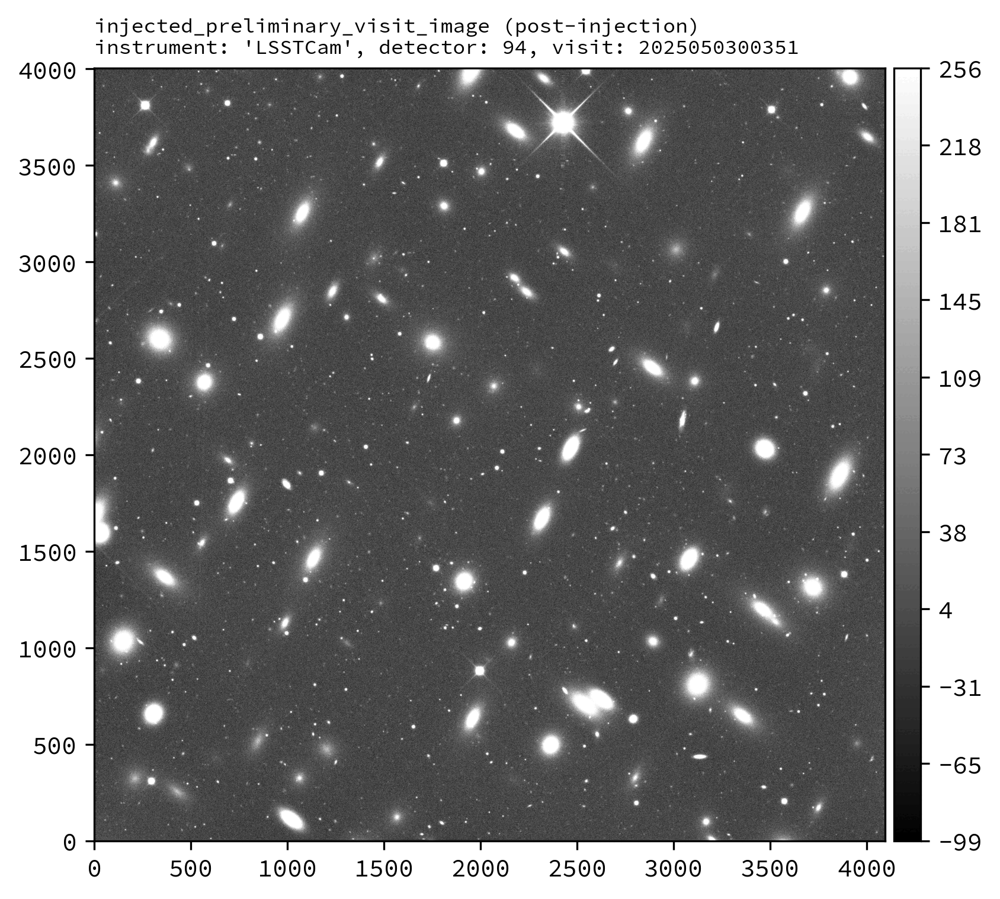
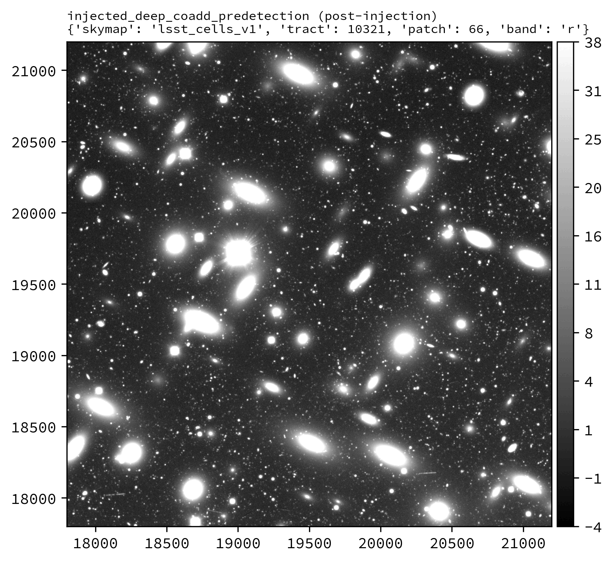
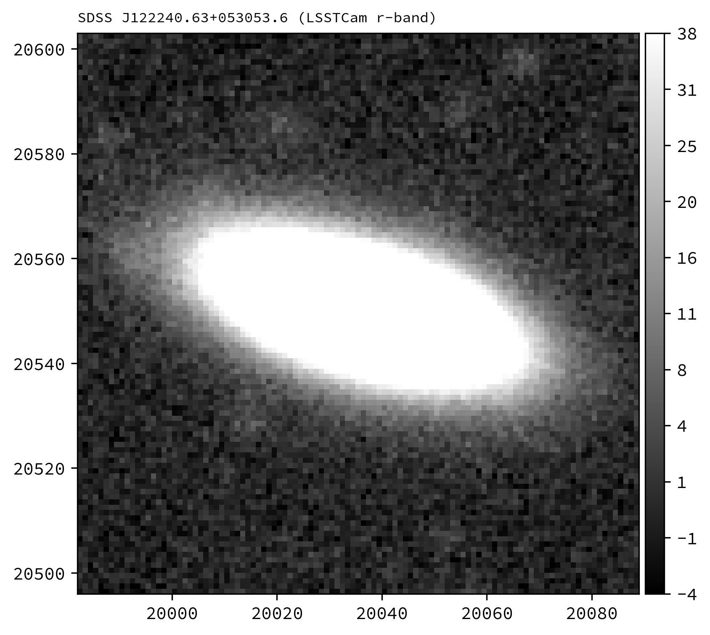

.. _lsst.source.injection-ref-inject:

==========================
 Inject Synthetic Sources
==========================

---------------------------------------------------------------------------
 Injecting Synthetic Sources Into Visit-Level or Coadd-Level Dataset Types
---------------------------------------------------------------------------

Synthetic sources can be injected into any imaging data product output by the LSST Science Pipelines.
This is useful for testing algorithmic performance on simulated data, where the truth is known, and for subsequent quality assurance tasks.

The sections below describe how to inject synthetic sources into a visit-level exposure-type or visit-type datasets (i.e., datasets with the dimension ``exposure`` or ``visit``), or into a coadd-level dataset.
Options for injection on the command line and in Python are presented.

Prior to injection, the instructions on this page assume that the user will already have in-place a fully qualified source injection pipeline definition YAML (see :ref:`lsst.source.injection-ref-make`) and a suitable synthetic source injection catalog describing the sources to be injected (see :ref:`lsst.source.injection-ref-generate`) which has been ingested into the data butler (see :ref:`lsst.source.injection-ref-ingest`).

.. _lsst.source.injection-ref-inject-cli:

Injection on the Command Line
=============================

Source injection on the command line is performed using the :command:`pipetask run` command.
The process for injection into visit-level imaging (i.e., ``exposure`` or ``visit`` type data) or injection into coadd-level imaging (e.g., a `deep_coadd_predetection``) is largely the same, save for the use of a different data query and a different injection task or pipeline subset.

The following command line example injects synthetic sources into the LSST exposure 2025050300351 detector 94 ``post_isr_image`` dataset.
For the purposes of this example we run the ``isr``, ``injectExposure`` and ``calibrateImage`` tasks.
These tasks will process raw science data through to preliminary visit-level calibrated output imaging.
The ``injectExposure`` task (:lsst-task:`~lsst.source.injection.ExposureInjectTask`) has been merged into a reference pipeline following a successful run of :doc:`make_injection_pipeline <../scripts/make_injection_pipeline>`, with neighboring task connections modified to account for source injection.

.. tip::

    Injection into a coadd-level data product such as a ``deep_coadd_predetection`` can easily be achieved by generating a new injection pipeline, substituting ``injectExposure`` for ``injectCoadd`` in the list of tasks being run, and modifying the ``-d`` data query.
    For the injection catalog generated in these notes, this coadd-level data query would work well:

    .. code-block::

        -d "instrument='LSSTCam' AND skymap='lsst_cells_v1' AND tract=10321 AND patch=66 AND band='r'"

.. code::

    pipetask --long-log --log-file $LOGFILE \
    run --register-dataset-types \
    -b $REPO \
    -i $INPUT_DATA_COLL,$INJECTION_CATALOG_COLL \
    -o $OUTPUT_COLL \
    -p DRP-injection.yaml#isr,injectExposure,calibrateImage \
    -d "instrument='LSSTCam' AND exposure=2025050300351 AND detector=94"

*where*

    `$LOGFILE`
        The full path to a user-defined output log file.

    `$REPO`
        The path to the butler repository.

    `$INPUT_DATA_COLL`
        The name of the input data collection.

    `$INJECTION_CATALOG_COLL`
        The name of the input injection catalog collection.

    `$OUTPUT_COLL`
        The name of the injected output collection.

.. caution::

    Standard processing should not normally have to make use of the ``--register-dataset-types`` flag.
    This flag is only required to register a new output dataset type with the butler for the very first time.

    If injection outputs have already been generated within your butler repository, you should omit this flag from your run command to prevent any accidental registration of unwanted dataset types.

.. note::

    Existing subsets will have injection variants denoted by the prefix ``injected_``.
    These subsets only include the injection task (where relevant) and any tasks after the point of source injection.
    The ``injected_`` subsets can save memory and runtime if the tasks prior to injection have already been run.

The image plane of the ``injected_post_isr_image`` will be modified from the original by the addition of a light profile for every injected object.
By default the injected light profiles have simulated shot noise added. This can be turned off by setting ``add_noise`` to ``False`` in the injection task config.
The variance plane gains additional estimated variance consistent with the amount of light added to the image plane, including any simulated noise.

.. caution::

    Setting ``inject_variance`` to ``False`` in the injection task config will prevent any changes to the variance plane.
    Not modifying the variance plane is likely to bias any downstream measurements and should normally never be done, unless such bias is the object of study.

Assuming processing completes successfully, the ``injected_post_isr_image`` and associated ``injected_post_isr_image_catalog`` will be written to the butler repository.
Various downstream data products should also exist, including the ``injected_preliminary_visit_image`` dataset type (see example images below).

Standard log messages that get printed as part of a successful run may include lines similar to:

.. code-block:: shell

    Retrieved 216 injection sources from 3 HTM trixels.
    Identified 99 injection sources with centroids outside the padded image bounding box.
    Catalog cleaning removed 99 of 216 sources; 117 remaining for catalog checking.
    Catalog checking flagged 0 of 117 sources; 117 remaining for source generation.
    Adding INJECTED and INJECTED_CORE mask planes to the exposure.
    Generating 117 injection sources consisting of 1 unique type: Sersic(117).
    Injected 117 of 117 potential sources. 0 sources flagged and skipped.

An example injected output produced by the above snippet is shown below.

    ..

    Calibrated exposure (``preliminary_visit_image`` and
    ``injected_preliminary_visit_image``) data for LSSTCam visit 2025050300351, detector 94, showcasing the injection of a series of synthetic Sérsic sources.
    Images are asinh scaled.

    .. list-table::
        :widths: 1 1 1

        * - .. figure:: ../_assets/v2025050300351d94_pre_injection.png
                :name: v2025050300351d94_pre_injection
                :alt: LSSTCam visit 2025050300351, detector 94, before source injection.
                :align: center
                :width: 100%

                ..

                Before injection.
          - .. figure:: ../_assets/v2025050300351d94_post_injection.png
                :name: v2025050300351d94_post_injection
                :alt: LSSTCam visit 2025050300351, detector 94, after source injection.
                :align: center
                :width: 100%

                ..

                After injection.
          - .. figure:: ../_assets/v2025050300351d94_difference.png
                :name: v2025050300351d94_difference
                :alt: LSSTCam visit 2025050300351, detector 94, difference.
                :align: center
                :width: 100%

                ..

                Difference image.

.. _lsst.source.injection-ref-inject-python:

Injection in Python
===================

Source injection in Python is achieved by calling the source injection task classes directly.
As on the command line, the process for injection into visit-level imaging or coadd-level imaging is largely the same, save for the use of a different task class, a different data query, and use of different calibration data products (see the notes in the Python snippet below).

The following Python example injects synthetic sources into the LSSTCam r-band tract 10321 patch 66 ``deep_coadd_predetection`` dataset.
For the purposes of this example, we will just run the source injection task alone.

.. code-block:: python

    from lsst.daf.butler import Butler
    from lsst.source.injection import CoaddInjectConfig, CoaddInjectTask

    # NOTE: For injections into other dataset types, use the following instead:
    # from lsst.source.injection import ExposureInjectConfig, ExposureInjectTask
    # from lsst.source.injection import VisitInjectConfig, VisitInjectTask

    # Instantiate a butler.
    butler = Butler.from_config(REPO)

    # Load an input coadd dataset.
    dataId = dict(
        instrument="LSSTCam",
        skymap="lsst_cells_v1",
        tract=10321,
        patch=66,
        band="r",
    )
    input_exposure = butler.get(
        "deep_coadd_predetection",
        dataId=dataId,
        collections=INPUT_DATA_COLL,
    )
    # NOTE: Visit-level injections also require a visit summary table.
    # visit_summary = butler.get(
    #     "visit_summary",
    #     dataId=dataId,
    #     collections=INPUT_DATA_COLL,
    # )

    # Get calibration data products.
    psf = input_exposure.getPsf()
    photo_calib = input_exposure.getPhotoCalib()
    wcs = input_exposure.getWcs()
    # NOTE: Visit-level injections should instead use the visit summary table.
    # detector_summary = visit_summary.find(dataId["detector"])
    # psf = detector_summary.getPsf()
    # photo_calib = detector_summary.getPhotoCalib()
    # wcs = detector_summary.getWcs()

    # Load input injection catalogs, here just for r-band catalogs.
    injection_refs = butler.registry.queryDatasets(
        "injection_catalog",
        band="r",
        collections=INJECTION_CATALOG_COLL,
    )
    injection_catalogs = [butler.get(injection_ref) for injection_ref in injection_refs]

    # Instantiate the injection classes.
    inject_config = CoaddInjectConfig()
    inject_task = CoaddInjectTask(config=inject_config)

    # Run the source injection task.
    injected_output = inject_task.run(
        injection_catalogs=injection_catalogs,
        input_exposure=input_exposure.clone(),
        psf=psf,
        photo_calib=photo_calib,
        wcs=wcs,
    )
    injected_exposure = injected_output.output_exposure
    injected_catalog = injected_output.output_catalog

*where*

    `REPO`
        The path to the butler repository.

    `INPUT_DATA_COLL`
        The name of the input data collection.

    `INJECTION_CATALOG_COLL`
        The name of the input injection catalog collection.

An example injected output produced by the above snippet is shown below.

    ..

    Coadd-level (``deep_coadd_predetection`` and ``injected_deep_coadd_predetection``) data for LSSTCam tract 10321, patch 66 in the r-band, showcasing the injection of a series of synthetic Sérsic sources.
    Images are log scaled.

    .. list-table::
        :widths: 1 1 1

        * - .. figure:: ../_assets/t10321p66r_pre_injection.png
                :name: t10321p66r_sersic_pre_injection
                :alt: LSSTCam tract 10321, patch 66 in the r-band, before Sérsic source injection.
                :align: center
                :width: 100%

                ..

                Before injection.
          - .. figure:: ../_assets/t10321p66r_sersic_post_injection.png
                :name: t10321p66r_sersic_post_injection
                :alt: LSSTCam tract 10321, patch 66 in the r-band, after Sérsic source injection.
                :align: center
                :width: 100%

                ..

                After injection.
          - .. figure:: ../_assets/t10321p66r_sersic_difference.png
                :name: t10321p66r_sersic_difference
                :alt: LSSTCam tract 10321, patch 66 in the r-band, difference.
                :align: center
                :width: 100%

                ..

                Difference image.

.. _lsst.source.injection-ref-inject-stamps:

Injecting Postage Stamps
========================

The commands above have focussed on injecting synthetic parametric models produced by GalSim.
It's also possible to inject `FITS <https://fits.gsfc.nasa.gov/fits_documentation.html>`_ postage stamps directly into the data.
These may be real astronomical images, or they may be simulated images produced by other software.

By way of example, lets inject multiple copies of the SDSS galaxy `J122240.63+053053.6`_, a :math:`z\sim0.07` galaxy of brightness :math:`m_{r}\sim17.6` mag located in `lsst_cells_v1` tract 10321, patch 66.
First, lets construct a small postage stamp using existing LSSTCam data products:

.. code-block:: python

    from lsst.daf.butler import Butler
    from lsst.geom import Box2I, Extent2I, Point2I

    # Instantiate a butler.
    butler = Butler.from_config(REPO)

    # Get the deep_coadd_predetection for LSSTCam r-band tract 10321, patch 66.
    dataId = dict(
        instrument="LSSTCam",
        skymap="lsst_cells_v1",
        tract=10321,
        patch=66,
        band="r",
    )
    coadd = butler.get(
        "deep_coadd_predetection",
        dataId=dataId,
        collections=INPUT_DATA_COLL,
    )

    # Find the x/y coordinates for the galaxy.
    wcs = coadd.wcs
    x0, y0 = wcs.skyToPixelArray(185.6693295, 5.5149062, degrees=True)

    # Create a 107x107 pixel postage stamp centered on the galaxy.
    bbox = Box2I(Point2I(x0, y0), Extent2I(1,1))
    bbox.grow(53)
    stamp = coadd[bbox]

    # Save the postage stamp image to a FITS file.
    stamp.image.writeFits(POSTAGE_STAMP_FILE)

*where*

    `REPO`
        The path to the butler repository.

    `INPUT_DATA_COLL`
        The name of the input data collection.

    `POSTAGE_STAMP_FILE`
        The file name for the postage stamp FITS file.

This postage stamp looks like this:

    ..

    An LSSTCam r-band postage stamp of the SDSS galaxy `J122240.63+053053.6`_, a :math:`z\sim0.07` galaxy of brightness :math:`m_{r}\sim17.6` mag located in LSSTCam tract 10321, patch 66.
    Image is log scaled.

Next, lets construct a simple injection catalog and ingest it into the butler.
Injection of FITS-file postage stamps only requires the ``ra``, ``dec``, ``source_type``, ``mag`` and ``stamp`` columns to be specified in the injection catalog.
Note that below we switch from Python to the command line interface:

.. code-block:: shell

    generate_injection_catalog \
    -a 185.51 185.95 \
    -d 5.33 5.56 \
    -n 50 \
    -p source_type Stamp \
    -p mag 17.2 \
    -p stamp $POSTAGE_STAMP_FILE \
    -b $REPO \
    -w deep_coadd \
    -c $INPUT_DATA_COLL \
    --where "instrument='LSSTCam' AND skymap='lsst_cells_v1' AND tract=10321 AND patch=66 AND band='r'" \
    -i r \
    -o $INJECTION_CATALOG_COLL

*where*

    `$POSTAGE_STAMP_FILE`
        The file name for the postage stamp FITS file.

    `$REPO`
        The path to the butler repository.

    `$INPUT_DATA_COLL`
        The name of the input data collection.

    `$INJECTION_CATALOG_COLL`
        The name of the input injection catalog collection.

The first several rows from the injection catalog produced by the above snippet look like this:

.. code-block:: shell

    injection_id         ra                dec         source_type mag           stamp
    ------------ ------------------ ------------------ ----------- ---- -----------------------
            0 185.62261633068604   5.51954052453572       Stamp 17.2 my_injection_stamp.fits
            1 185.54700111177948  5.471189971018477       Stamp 17.2 my_injection_stamp.fits
            2  185.8702087112494  5.391756668952863       Stamp 17.2 my_injection_stamp.fits
            3 185.78081900198586  5.408787617963841       Stamp 17.2 my_injection_stamp.fits
            4 185.71204589111636  5.445704245746881       Stamp 17.2 my_injection_stamp.fits
    ...

Finally, lets inject our postage stamp multiple times into the LSSTCam r-band tract 10321, patch 66 image:

.. code-block:: shell

    pipetask --long-log --log-file $LOGFILE \
    run --register-dataset-types \
    -b $REPO \
    -i $INPUT_DATA_COLL,$INJECTION_CATALOG_COLL \
    -o $OUTPUT_COLL \
    -p $SOURCE_INJECTION_DIR/pipelines/inject_coadd.yaml \
    -d "instrument='LSSTCam' AND skymap='lsst_cells_v1' AND tract=10321 AND patch=66 AND band='r'" \
    -c injectCoadd:stamp_prefix=$MY_INJECTION_STAMP_DIR

*where*

    `$LOGFILE`
        The full path to a user-defined output log file.

    `$REPO`
        The path to the butler repository.

    `$INPUT_DATA_COLL`
        The name of the input data collection.

    `$INJECTION_CATALOG_COLL`
        The name of the input injection catalog collection.

    `$OUTPUT_COLL`
        The name of the injected output collection.

    `$SOURCE_INJECTION_DIR`
        The path to the source injection package directory.

    `$MY_INJECTION_STAMP_DIR`
        The directory where the injection FITS file is stored.

.. tip::

    If the injection FITS file is not in the same directory as the working directory where the ``pipetask run`` command is run, the ``stamp_prefix`` configuration option can be used as shown here.
    This appends a string to the beginning of the FITS file name taken from the catalog, allowing for your FITS files to be stored in a different directory to the current working directory.

Running the above snippet produces the following:

.. figure:: ../_assets/t10321p66r_stamp_blink.gif
    :name: t10321p66r_stamp_blink
    :alt: LSSTCam tract 10321, patch 66 in the r-band, showcasing the injection of multiple copies of a postage stamp.
    :align: center
    :width: 100%

    ..

    Coadd-level (``deep_coadd_predetection`` and ``injected_deep_coadd_predetection``) data for LSSTCam tract 10321, patch 66 in the r-band, showcasing the injection of multiple copies of a postage stamp.
    Images are log scaled.

    .. list-table::
        :widths: 1 1 1

        * - .. figure:: ../_assets/t10321p66r_pre_injection.png
                :name: t10321p66r_stamp_pre_injection
                :alt: LSSTCam tract 10321, patch 66 in the r-band, before postage stamp injection.
                :align: center
                :width: 100%

                ..

                Before injection.
          - .. figure:: ../_assets/t10321p66r_stamp_post_injection.png
                :name: t10321p66r_stamp_post_injection
                :alt: LSSTCam tract 10321, patch 66 in the r-band, after postage stamp injection.
                :align: center
                :width: 100%

                ..

                After injection.
          - .. figure:: ../_assets/t10321p66r_stamp_difference.png
                :name: t10321p66r_stamp_difference
                :alt: LSSTCam tract 10321, patch 66 in the r-band, difference.
                :align: center
                :width: 100%

                ..

                Difference image.

.. seealso::

    For a "Rubin themed" example postage stamp injection, see the top of the :ref:`FAQs page <t9813p42i_zoom_stamp_prepost_injection>`.

.. _J122240.63+053053.6: https://ned.ipac.caltech.edu/byname?objname=SDSS+J122240.63%2B053053.6&hconst=67.8&omegam=0.308&omegav=0.692&wmap=4&corr_z=1

.. _lsst.source.injection-ref-inject-wrap:

Wrap Up
=======

This page has described how to inject synthetic sources into a visit-level exposure-type or visit-type dataset, or into a coadd-level co-added dataset.
Options for injection on the command line and in Python have been presented.
The special case of injecting FITS-file postage stamp images has also been covered.

Move on to :ref:`another quick reference guide <lsst.source.injection-ref>`, consult the :ref:`FAQs <lsst.source.injection-faqs>`, or head back to the `main page <..>`_.
