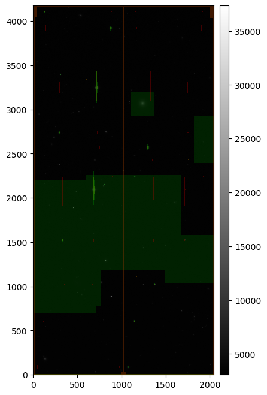
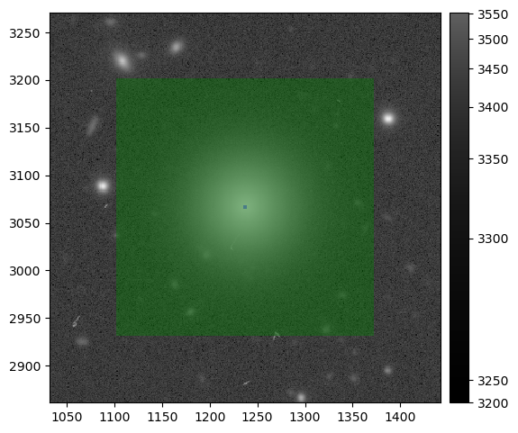
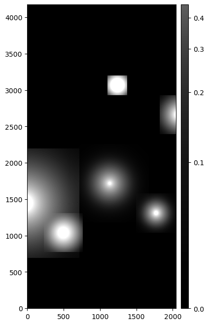
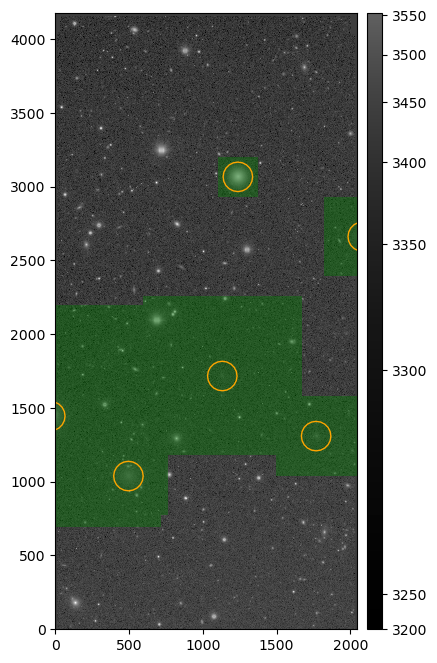

.. _lsst.source.injection-ref-inspect:

==========================
 Inspect Injected Outputs
==========================

-------------------------------------------------------------------
 Visualizing Injected Output Imaging and Examining Output Catalogs
-------------------------------------------------------------------

Once source injection has completed, the source injection task will output two dataset types: an injected image, and an associated injected catalog.
The injected image is a copy of the original image with the injected sources added.
The injected catalog is a catalog of the injected sources, with the same schema as the original catalog and additional columns describing source injection outcomes.

There are multiple ways to visualize injected output imaging.
The examples on this page make use of the official `lsst.afw.display` tools for visualization, but other standard visualization tools can also be used, such as those in `astropy.visualization`.

.. _lsst.source.injection-ref-inspect-image:

Visualizing an Injected Image
=============================

First, in Python, lets load an example ``injected_postISRCCD`` image produced in :ref:`lsst.source.injection-ref-inject`:

.. code-block:: python

    from lsst.daf.butler import Butler

    # Instantiate a butler.
    butler = Butler(REPO)

    # Load an injected_postISRCCD image.
    dataId = dict(
        instrument="HSC",
        exposure=1228,
        detector=51,
    )
    injected_postISRCCD = butler.get(
        "injected_postISRCCD",
        dataId=dataId,
        collections=OUTPUT_COLL,
    )

*where*

    `REPO`
        The path to the butler repository.

    `OUTPUT_COLL`
        The name of the injected output collection.

Next lets set up the display, using `matplotlib` as our backend, and display the image using `~lsst.afw.display.Display.mtv`:

.. code-block:: python

    import matplotlib.pyplot as plt
    from lsst.afw.display import getDisplay, setDefaultBackend

    # Set matplotlib as the default backend.
    setDefaultBackend("matplotlib")

    # Create a figure and a display.
    fig, ax = plt.subplots(figsize=(6,8))
    display = getDisplay(frame=fig, reopenPlot=True)

    # Display the injected_postISRCCD image.
    display.mtv(injected_postISRCCD)

Running the above returns something similar to the following:

    ..

    Injected post-ISR CCD (``injected_postISRCCD``) for HSC exposure 1228, detector 51, visualized using `lsst.afw.display`.
    Image is scaled using default `~lsst.afw.display.Display.mtv` scaling, with semi-transparent mask planes overlaid.

A number of mask planes of varying color are displayed above.
We can examine the `mask` attribute for the ``injected_postISRCCD`` to determine what each color represents:

.. code-block:: python

    # Sort the mask plane dict by bit value and print their mask plane color.
    mask_plane_dict = injected_postISRCCD.mask.getMaskPlaneDict()
    sorted_mask_plane_dict = dict(
        sorted(
            mask_plane_dict.items(),
            key=lambda item: item[1]
        )
    )
    max_key_length = max(map(len, sorted_mask_plane_dict.keys()))
    for key in sorted_mask_plane_dict.keys():
        print(f"{key: <{max_key_length}} : {display.getMaskPlaneColor(key)}")

The above returns something similar to:

.. code-block:: python

    BAD               : red
    SAT               : green
    INTRP             : green
    CR                : magenta
    EDGE              : yellow
    DETECTED          : blue
    DETECTED_NEGATIVE : cyan
    SUSPECT           : yellow
    NO_DATA           : orange
    CROSSTALK         : red
    INJECTED          : green
    INJECTED_CORE     : blue
    NOT_DEBLENDED     : cyan
    UNMASKEDNAN       : magenta

.. note::

    The mask plane bit values and colors may vary from one run to another.
    As such, you should not rely on these values to remain the same between runs.

Note the presence of the ``INJECTED`` and ``INJECTED_CORE`` mask planes.
These planes have been added by the source injection task.

The ``INJECTED`` mask plane shows the draw size for each injected source.
As such, this shows all pixels which were potentially touched by synthetic source injection.

The ``INJECTED_CORE`` mask plane shows the central :math:`3 \times 3` pixel region of each injected source.
This core region is used to generate an injection flag, which is picked up by downstream data processing tasks to exclude injected sources from consideration for things such as astrometric fitting.

The `~lsst.afw.display.Display.mtv` plotting library is reasonably versatile and can be used to visualize the injected image in a number of ways.
For example, lets mask all mask planes except the INJECTED mask plane, and lets change the scaling for the science image to `asinh` `zscale` scaling:

.. code-block:: python

    # Create a figure and a display.
    fig, ax = plt.subplots(figsize=(6, 8))
    display = getDisplay(frame=fig, reopenPlot=True)

    # Hide all mask planes except INJECTED, using asinh zscale image scaling.
    display.setMaskTransparency(100)
    display.setMaskTransparency(60, name="INJECTED")
    display.scale("asinh", "zscale")

    # Display the injected_postISRCCD image.
    display.mtv(injected_postISRCCD)

The snippet above returns something similar to:

.. figure:: ../_assets/e1228d51_ref_inspect_2.png
    :name: e1228d51_ref_inspect_2
    :alt: Injected post-ISR CCD (``injected_postISRCCD``) for HSC exposure 1228, detector 51, visualized using `lsst.afw.display`.
    :align: center
    :width: 100%

    ..

    Injected post-ISR CCD (``injected_postISRCCD``) for HSC exposure 1228, detector 51, visualized using `lsst.afw.display`.
    Image is `asinh` `zscale` scaled, with the ``INJECTED`` mask plane shown overlaid.

We can also optionally zoom in to a specific coordinate and highlight the ``INJECTED_CORE`` mask plane as well:

.. code-block:: python

    # Create a figure and a display.
    fig, ax = plt.subplots(figsize=(6, 8))
    display = getDisplay(frame=fig, reopenPlot=True)

    # Show only INJECTED/INJECTED_CORE mask planes, using asinh zscale scaling.
    display.setMaskTransparency(100)
    display.setMaskTransparency(60, name="INJECTED")
    display.setMaskTransparency(60, name="INJECTED_CORE")
    display.scale("asinh", "zscale")

    # Display the injected_postISRCCD image and zoom in on [1237, 3066].
    display.mtv(injected_postISRCCD)
    display.zoom(10, 1237, 3066)

The modified snippet above returns something similar to:

    ..

    A zoomed in section of an injected post-ISR CCD (``injected_postISRCCD``) for HSC exposure 1228, detector 51, visualized using `lsst.afw.display`.
    Image is `asinh` `zscale` scaled, with the ``INJECTED`` (green) and ``INJECTED_CORE`` (blue) mask planes overlaid.

A difference image can be constructed by subtracting the original image from the injected image:

.. code-block:: python

    # Load the original postISRCCD image with the butler.
    postISRCCD = butler.get(
        "postISRCCD",
        dataId=dataId,
        collections=OUTPUT_COLL,
    )

    # Subtract the original image from the injected image.
    injected_diff = injected_postISRCCD.clone()
    injected_diff.image.array = injected_postISRCCD.image.array - postISRCCD.image.array

    # Create a figure and a display.
    fig, ax = plt.subplots(figsize=(6, 8))
    display = getDisplay(frame=fig, reopenPlot=True)

    # Hide all mask planes, and use asinh zscale scaling.
    display.setMaskTransparency(100)
    display.scale("asinh", "zscale")

    # Display the injected difference image.
    display.mtv(injected_diff)

*where*

    `OUTPUT_COLL`
        The name of the injected output collection.

The difference image snippet above returns:

    ..

    An image showing the difference between an injected post-ISR CCD (``injected_postISRCCD``) and a standard post-ISR CCD (``postISRCCD``) for HSC exposure 1228, detector 51, visualized using `lsst.afw.display`.
    Image is `asinh` `zscale` scaled.

.. _lsst.source.injection-ref-inspect-catalog:

Examine an Injected Catalog
===========================

The source detection task also outputs an injected catalog.
The catalog is named in line with the injected image; for example, an injection into a ``postISRCCD`` produces an ``injected_postISRCCD`` and an ``injected_postISRCCD_catalog``.

The injected catalog has the same schema as the original catalog, with additional columns providing injection flag information and the draw size (in pixels) associated with the injected source.

The example below loads the associated ``injected_postISRCCD_catalog`` for the ``injected_postISRCCD`` from above:

.. code-block:: python

    from lsst.daf.butler import Butler

    # Instantiate a butler.
    butler = Butler(REPO)

    # Load an injected_postISRCCD image.
    dataId = dict(
        instrument="HSC",
        exposure=1228,
        detector=51,
    )
    injected_postISRCCD_catalog = butler.get(
        "injected_postISRCCD_catalog",
        dataId=dataId,
        collections=OUTPUT_COLL,
    )

*where*

    `REPO`
        The path to the butler repository.

    `OUTPUT_COLL`
        The name of the injected output collection.

For this example, this catalog looks like this:

.. code-block:: python

    injection_id injection_flag injection_draw_size         ra                dec         source_type mag   n  half_light_radius
    ------------ -------------- ------------------- ------------------ ------------------ ----------- ---- --- -----------------
               0              0                 268  149.8402465482284 2.2102027405735303      Sersic 15.0 1.0               5.0
              42              0                1504 149.76524921034587  2.150907661348014      Sersic 15.0 4.0               5.0
              70              0                 536  149.7464875946779 2.1755984611156305      Sersic 17.0 1.0              10.0
              81              0                 538 149.82148074871415  2.249712897755423      Sersic 17.0 2.0               5.0
             142              0                 542 149.75897021350687  2.234875155713459      Sersic 19.0 2.0               5.0
             152              0                1078 149.77773402454838  2.205244886929932      Sersic 19.0 2.0              10.0

This injected catalog may not be a complete copy of the input catalog.
Only sources which stood any chance of being injected are included in the injected catalog.
For example, sources which were too far away from the edge of the image to be injected are not included in the injected catalog.

The injection flag value is a binary flag which encodes the outcome of source injection for each source.
An injection flag value of 0 indicates that source injection for this source completed successfully.
The bit-wise value for all potential flags may be accessed from the metadata attached to the injected catalog:

.. code-block:: python

    # Get injection flags from the metadata; print their label and bit value.
    injection_flags = injected_postISRCCD_catalog.meta
    max_key_length = max(map(len, injection_flags.keys()))
    for key, value in injection_flags.items():
        print(f"{key: <{max_key_length}} : {value}")

The snippet above returns:

.. code-block:: python

    MAG_BAD           : 0
    TYPE_UNKNOWN      : 1
    SERSIC_EXTREME    : 2
    NO_OVERLAP        : 3
    FFT_SIZE_ERROR    : 4
    PSF_COMPUTE_ERROR : 5

*where*

    `MAG_BAD`
        The supplied magnitude was NaN or otherwise non-numeric.

    `TYPE_UNKNOWN`
        The ``source_type`` was not an allowed source type.

    `SERSIC_EXTREME`
        The requested Sérsic index was outside the range allowed by GalSim (0.3 < n < 6.2).

    `NO_OVERLAP`
        Whilst the centroid of the source *was* close enough to the field of view to be considered for source injection, the draw size was sufficiently small such that no pixels within that bounding box overlap the image.

    `FFT_SIZE_ERROR`
        A `~galsim.errors.GalSimFFTSizeError` was raised when attempting convolution with the PSF (usually caused by a large requested draw size).

    `PSF_COMPUTE_ERROR`
        A PSF computation error was raised by GalSim.

A source may be flagged for multiple reasons.
For example, a source with an invalid magnitude and an unknown source type would have a flag value of :math:`2^0 + 2^1 = 3`.

.. _lsst.source.injection-ref-inspect-coordinates:

Overplot Injected Source Coordinates
=====================================

The injected catalog may be used to overplot the coordinates of injected sources on the injected image:

.. code-block:: python

    from lsst.daf.butler import Butler
    from lsst.geom import Box2D, SpherePoint, degrees

    # Assuming the injected_postISRCCD/injected_postISRCCD_catalog are loaded.

    # Get the WCS information from the visit_summary table initially used.
    butler = Butler(REPO)
    dataId = dict(
        instrument="HSC",
        visit=1228,
        detector=51,
    )
    visit_summary = butler.get(
        "visit_summary",
        dataId=dataId,
        collections=INPUT_DATA_COLL,
    )
    wcs = visit_summary.find(dataId["detector"]).getWcs()

    # Get x/y pixel coordinates for injected sources.
    xs, ys = wcs.skyToPixelArray(
        injected_postISRCCD_catalog["ra"],
        injected_postISRCCD_catalog["dec"],
        degrees=True
    )

    # Create a figure and a display, using WCS information.
    fig, ax = plt.subplots(figsize=(6, 8))
    display = getDisplay(frame=fig, reopenPlot=True)

    # Hide all mask planes except INJECTED, using asinh zscale image scaling.
    display.setMaskTransparency(100)
    display.setMaskTransparency(60, name="INJECTED")
    display.scale("asinh", "zscale")

    # Display the injected_postISRCCD image.
    display.mtv(injected_postISRCCD)

    # Overplot injected source centroids.
    with display.Buffering():
        for (x,y) in zip(xs, ys):
            display.dot("o", x, y, size=100, ctype="orange")

*where*

    `REPO`
        The path to the butler repository.

    `$INPUT_DATA_COLL`
        The name of the input data collection.

Running the above snippet returns the following figure:

    ..

    Injected post-ISR CCD (``injected_postISRCCD``) for HSC exposure 1228, detector 51, visualized using `lsst.afw.display`.
    Image is `asinh` `zscale` scaled, with the ``INJECTED`` mask plane shown overlaid.
    Injected source centroids are circled in orange.

.. _lsst.source.injection-ref-inspect-wrap:

Wrap Up
=======

This page has presented methods for visualizing an injected output file and inspecting an injected catalog.
Information on how to filter various mask planes during visualization, zoom in on specific regions, highlight sources using their coordinates, construct difference images and determine which sources were successfully injected by using injection flags are discussed.

Move on to :ref:`another quick reference guide <lsst.source.injection-ref>`, consult the :ref:`FAQs <lsst.source.injection-faqs>`, or head back to the `main page <..>`_.
