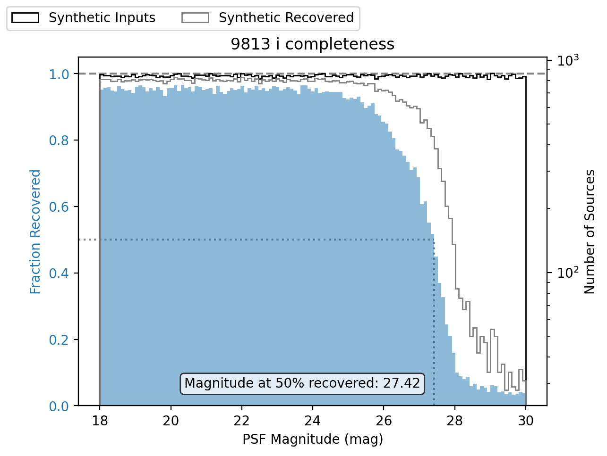

.. _lsst.source.injection-ref-match:

========================
 Match Injected Outputs
========================

-------------------------------------------------
 Consolidate and match source injection catalogs
-------------------------------------------------

This page covers how to match injected input catalogs to output data catalogs.
This process can generally be split into two parts: consoliding per-patch injected catalogs into tract-level input catalogs, and matching the input and output catalogs.

Consolidate injected catalogs
=============================

The butler may split up catalogs which cover multiple photometry bands or which cover large areas of sky for memory efficiency, even when a single catalog is injected.
For example, if a coadd-level injected catalog covers a whole tract across multiple photometry bands, the injected catalogs will be split and stored with the dimensions ``{patch, band}``.
Before matching the injected input catalogs to the processed output catalog, the per-patch and per-band inputs must be consolidated into a single tract level catalog.
This can be done by using ``pipetask run`` to run ``ConsolidateInjectedCatalogsTask`` from ``pipelines/consolidate_injected_deepCoadd_catalogs.yaml``.

.. code::

    pipetask --long-log --log-file $LOGFILE run \
    -b $REPO \
    -i $PROCESSED_DATA_COLL \
    -o $CONSOLIDATED_CATALOG_COLL \
    -p $SOURCE_INJECTION_DIR/pipelines/consolidate_injected_deepCoadd_catalogs.yaml \
    -d "instrument='HSC' AND skymap='hsc_rings_v1' AND tract=9813 AND patch=42 AND band='i'"

*where*

    `$LOGFILE`
        The full path to a user-defined output log file.

    `$REPO`
        The path to the butler repository.

    `$PROCESSED_DATA_COLL`
        The name of the input injected catalog collection.

    `$CONSOLIDATED_CATALOG_COLL`
        The name of the consolidated injected output collection.

Matching
========

Now that we have our consolidated tract-level injected catalog and a reference tract-level standard catalog, we can move on to matching these two sets of catalogs together.

The matching tasks are ``MatchTractCatalogTask`` and ``DiffMatchedTractCatalogTask``.
The first task performs a spatial probablistic match with minimal flag cuts, and the second computes any relevant statistics.
These tasks are located in the ``pipelines/match_injected_tract_catalog.yaml`` pipeline definition file, with the labels ``match_object_to_truth`` and ``compare_object_to_truth``.
The pipeline graph for the consolidation and matching process is shown below:

.. code::

        ○  injected_deepCoadd_catalog
        │
      ○ │  skyMap
      ├─┤
      │ ■  consolidate_injected_catalogs
      │ │
      │ ○  injected_deepCoadd_catalog_tract
      │ │
    ○ │ │  injected_objectTable_tract
  ╭─┼─┼─┤
  ■ │ │ │  match_object_to_truth
  │ │ │ │
  ◍ │ │ │  match_target_injected_deepCoadd_catalog_tract_injected_objectTable_tract, match_ref_injected_deepCoadd_catalog_tract_injected_objectTable_tract
  ╰─┴─┴─┤
        ■  compare_object_to_truth
        │
        ○  matched_injected_deepCoadd_catalog_tract_injected_objectTable_tract

Matching two tract-level catalogs can be done trivially with a ``pipetask run`` command as below:

.. code::

    pipetask --long-log --log-file $LOGFILE run \
    -b $REPO \
    -i $CONSOLIDATED_CATALOG_COLL \
    -o $MATCHED_CATALOG_COLL \
    -p $SOURCE_INJECTION_DIR/pipelines/match_injected_tract_catalog.yaml \
    -d "instrument='HSC' AND skymap='hsc_rings_v1' AND tract=9813 AND patch=42 AND band='i'"

*where*

    `$LOGFILE`
        The full path to a user-defined output log file.

    `$REPO`
        The path to the butler repository.

    `$CONSOLIDATED_CATALOG_COLL`
        The name of the consolidated injected input collection.

    `$MATCHED_CATALOG_COLL`
        The name of the matched injected output collection.

.. note::

    Within ``pipelines/match_injected_tract_catalog.yaml`` there are various config options for pre-matching flag selections, columns to copy from the reference and target catalogs, etc.

Visualize the matched catalog and compute metrics
=================================================

One metric to determine the quality of an injection run is completeness, or the ratio of matched sources to injected sources.
The following is an example of a completeness plot using ``matplotlib.pyplot``.

.. code-block:: python

    from lsst.daf.butler import Butler
    import astropy.units as u
    import matplotlib.pyplot as plt
    import numpy as np

    # Load the matched catalog with the butler.
    butler = Butler("/sdf/group/rubin/repo/main")
    collections = "u/mccann/DM-41210/RC2"
    dtype = "matched_injected_deepCoadd_catalog_tract_injected_objectTable_tract"
    tract = 9813
    dataId = {"skymap":"hsc_rings_v1", "tract":tract}
    data = butler.get(dtype, collections=collections, dataId=dataId)

    # Define a matched source flag.
    matched = np.isfinite(data["match_distance"])

    # Make a completeness plot.
    band="i"
    flux = f"ref_{band}_flux"
    mags = ((data[flux] * u.nJy).to(u.ABmag)).value
    fig, axLeft = plt.subplots()
    axRight = axLeft.twinx()
    axLeft.tick_params(axis="y", labelcolor="C0")
    axLeft.set_ylabel("Fraction Recovered", color="C0")
    axLeft.set_xlabel("PSF Magnitude (mag)")
    axRight.set_ylabel("Number of Sources")
    nInput, bins, _ = axRight.hist(
        mags,
        range=(np.nanmin(mags), np.nanmax(mags)),
        bins=121,
        log=True,
        histtype="step",
        label="Synthetic Inputs",
        color="black",
    )
    nOutput, _, _ = axRight.hist(
        mags[matched],
        range=(np.nanmin(mags[matched]), np.nanmax(mags[matched])),
        bins=bins,
        log=True,
        histtype="step",
        label="Synthetic Recovered",
        color="grey",
    )
    xlims = plt.gca().get_xlim()
    # Find bin where the fraction recovered first falls below 0.5
    lessThanHalf = np.where((nOutput / nInput < 0.5))[0]
    if len(lessThanHalf) == 0:
        mag50 = np.nan
    else:
        mag50 = np.min(bins[lessThanHalf])
        axLeft.plot([xlims[0], mag50], [0.5, 0.5], ls=":", color="grey")
        axLeft.plot([mag50, mag50], [0, 0.5], ls=":", color="grey")
    plt.xlim(xlims)
    fig.legend(loc="outside upper left", ncol=2)
    axLeft.axhline(1, color="grey", ls="--")
    axLeft.bar(
        bins[:-1],
        nOutput / nInput,
        width=np.diff(bins),
        align="edge",
        color="C0",
        alpha=0.5,
        zorder=10,
    )
    bboxDict = dict(boxstyle="round", facecolor="white", alpha=0.75)
    info50 = "Magnitude at 50% recovered: {:0.2f}".format(mag50)
    axLeft.text(0.3, 0.15, info50, transform=fig.transFigure, bbox=bboxDict, zorder=11)
    plt.title(f"{tract} {band} completeness")
    fig = plt.gcf()

    ..

Wrap Up
=======

This page has presented methods for consolidating injected catalogs, matching injected inputs with processed outputs, and visualizing a matched catalog.
Currently ``source_injection`` only supports consolidation and matching for coadd-level injection, but in the future these methods may be generalized for use at the visit and exposure level.

Move on to :ref:`another quick reference guide <lsst.source.injection-ref>`, consult the :ref:`FAQs <lsst.source.injection-faqs>`, or head back to the `main page <..>`_.
